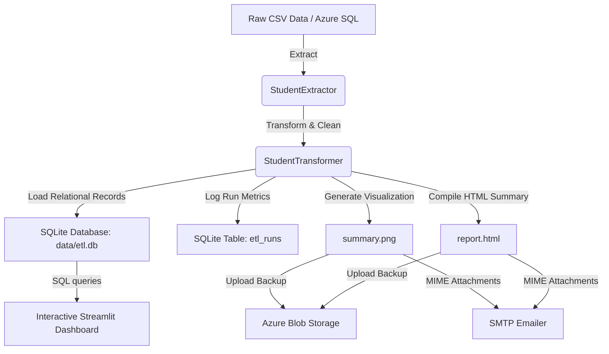

# Cloud-Based Student Performance Analytics and ETL Pipeline

A professional, end-to-end data engineering capstone project utilizing Python, Streamlit, SQLite, SQLAlchemy, Plotly, Pandas, and Azure Blob Storage. It extracts student data, performs cleaning, formatting, and mathematical grade mapping, loads clean records to a SQLite database, uploads artifacts to Azure, distributes HTML report notifications via SMTP, and displays dashboard analytics similar to Power BI and Tableau.

---

## Architecture & Data Flow



---

## Project Structure

```text
├── etl/
│     ├── extractor.py         # Handles extraction from CSV or Azure SQL
│     ├── transformer.py       # Data cleaning, grade mapping, and quality audit
│     ├── loader.py            # SQLite schema initialization and ORM loader
│     ├── azure_loader.py      # Azure Blob Storage uploader (with mock mode fallback)
│     ├── azure_sql_reader.py  # Optional pyodbc extractor for cloud SQL servers
│     ├── viz.py               # Renders static matplotlib dashboard report graphics
│     ├── emailer.py           # Sends status updates and templates via SMTP
│     ├── logger.py            # Console and file logger configuration
│     └── templates/
│             email_template.html
│
├── dashboard/
│     ├── dashboard.py         # Dashboard router, user authentication, and global CSS
│     ├── theme.py             # CSS styling, database helpers, and sidebars
│     └── pages/
│            Home.py           # Core analytics cards, filters, and Plotly charts
│            Students.py       # Student details lookup cards and GPA trends
│            Performance.py    # Exam score distributions and outlier boxplots
│            Attendance.py     # Attendance average grids and shortages alerts
│            Departments.py    # Individual department summary metrics
│            DataQuality.py    # Missing values and duplicate clean logs
│            Reports.py        # File export buttons (CSV, Excel, PDF, HTML)
│            Settings.py       # Toggles, Dark Mode settings, and manual runs
│
├── data/
│      student_data.csv        # Raw initial CSV (500 records)
│      etl.db                  # Clean SQLite relational database
│      pipeline_status.json    # Pipeline metadata cache for dashboards
│
├── reports/
│      report.html             # Compiled static summary report
│      summary.png             # Static matplotlib summary chart
│      mock_email.html         # Emulated email template layout output
│
├── logs/
│      etl.log                 # System action and execution log traces
│
├── .env                       # Environment variables config
├── requirements.txt           # Pip dependencies
├── run_etl.py                 # Pipeline triggers script wrapper
└── README.md                  # System handbook documentation
```

---

## Database Schema

The SQLite database (`data/etl.db`) maintains two schema tables managed through SQLAlchemy models:

### 1. `students` Table
*   `studentid` (VARCHAR, Primary Key) - Unique student code (e.g. `STU1001`)
*   `name` (VARCHAR) - Student full name
*   `department` (VARCHAR) - Engineering department branch (CSE, ECE, EEE, MECH, CIVIL, IT)
*   `gender` (VARCHAR) - Student gender
*   `attendance` (FLOAT) - Attendance percentage rate (0 to 100)
*   `mid1` / `mid2` (FLOAT) - Mid-term exam scores (0 to 100)
*   `assignment` (FLOAT) - Project assignment score (0 to 100)
*   `finalmarks` (FLOAT) - Term final exam score (0 to 100)
*   `average_marks` (FLOAT) - Weighted average: `0.20 * mid1 + 0.20 * mid2 + 0.10 * assignment + 0.50 * finalmarks`
*   `grade` (VARCHAR) - Grade letter mark (`A+`, `A`, `B`, `C`, `D`, `F`)
*   `result` (VARCHAR) - Outcome status (`Pass` if average >= 50 else `Fail`)
*   `date` (VARCHAR) - Academic record transaction date

### 2. `etl_runs` Table
*   `run_id` (INTEGER, Primary Key) - Autoincrement sequence ID
*   `timestamp` (DATETIME) - Execution completion date/time
*   `status` (VARCHAR) - Success / Failure log
*   `records_processed` (INTEGER) - Quantities loaded
*   `quality_score` (FLOAT) - Completeness score (0 to 100%)
*   `details` (TEXT) - JSON string tracking duplicate count and null count

---

## Installation & Setup

1. **Clone/Navigate to the Project Directory:**
   ```powershell
   cd c:\Users\user\OneDrive\Desktop\Azure-ETL-Pipeline-Studio
   ```

2. **Establish the Virtual Environment & Install Packages:**
   ```powershell
   python -m venv .venv
   .venv\Scripts\activate
   pip install -r requirements.txt
   ```

3. **Configure Environment Variables (`.env`):**
   *   The system has **Local Mock Toggles** set to `True` by default, letting the system run out-of-the-box without Azure Blob connections or Gmail SMTP configurations.
   *   To bind real cloud integrations, adjust `.env`:
       ```ini
       AZURE_CONNECTION_STRING="your-actual-azure-storage-connection-string"
       USE_MOCK_AZURE=False
       
       EMAIL_SENDER="your-gmail-account@gmail.com"
       EMAIL_PASSWORD="your-google-app-password"
       USE_MOCK_EMAIL=False
       ```

---

## Running the System

### Phase 1: Triggering the ETL Ingestion Pipeline
To execute the ETL sequence headlessly, run:
```powershell
.venv\Scripts\python run_etl.py
```
This sanitizes data, maps grades, writes tables to SQLite, saves reports to `reports/`, and triggers mock/real cloud backups and email notifications.

### Phase 2: Launching the Analytics Dashboard
To start the local Web server and launch the interactive dashboard:
```powershell
.venv\Scripts\streamlit run dashboard/dashboard.py
```
Access the dashboard via web browser at `http://localhost:8501`.

*   **Credentials:**
    *   **Username:** `admin`
    *   **Password:** `admin123`

---

## Verification checklist
*   Check the console logs and file log outputs at `logs/etl.log`.
*   View emulated HTML reports at `reports/report.html` and emulated email sheets at `reports/mock_email.html`.
*   Connect SQLite clients to view databases at `data/etl.db`.
